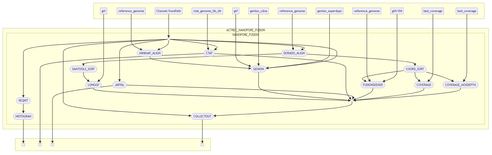

# actrec/nanopore_fusion

## Introduction

**actrec/nanopore_fusion** is a modular, computational pipeline for identification of gene fusions from long-read RNA sequencing data. The pipeline is implemented in Nextflow. It utilzes long read data in FASTQ format, aligns the reads to human genome, and calls RNA fusions. It also integrates results from multiple fusion detection tools (Jaffal, CTAT-LR-fusion, Genion and LongGF) and compiles them into a single spreadsheet, which includes fusion calls, as well as coverage information across target regions. Additionally, the pipeline generates a merged TSV file that can be directly used as input for FusViz, a web-based application for visualizing, interpreting, and prioritizing genomic and transcriptomic structural variations. Other key outputs include - 
- An interactive HTML fusion visualization report from CTAT-LR-fusion
- A read length distribution histogram for the FASTQ inputs
- Sorted and indexed BAM files

## Pipeline summary

<p align="center">

</p>


## Usage

The following parameters are required to be modified in the `params` section of the `nextflow.config` - 

- *genome* = The Reference genome for the pipeline can be downloaded from -  https://storage.googleapis.com/genomics-public-data/resources/broad/hg38/v0/Homo_sapiens_assembly38.fasta

- *gtf* = The GTF file for Genion and LongGF can be downloaded from -
ftp://ftp.ensembl.org/pub/release-105/gtf/homo_sapiens/Homo_sapiens.GRCh38.105.gtf.gz

Please check if the chromosome names are matching in the Reference genome and the GTF files.

- *cdna* & *superdups* = Genion additionally requires 'cdna.selfalign.tsv' and 'genomicSuperDups.txt' as input. These files need to be generated as per instructions on Genion github -  https://github.com/vpc-ccg/genion?tab=readme-ov-file#input

- *genome_lib* = CTAT-LR-fusion requires CTAT genome lib, which can be downloaded from -
https://data.broadinstitute.org/Trinity/CTAT_RESOURCE_LIB/GRCh38_gencode_v22_CTAT_lib_Mar012021.source.tar.gz


## Running the pipeline

1. Transfer the `fastq.gz` files to the `sequences/` folder.

2. The samplesheet is `samplesheet.csv`. The sample_ids, without the file extension, should be mentioned in samplesheet in the following format-  
sample1  
sample2  
sample3  
Please check for empty lines in the samplesheet before running the pipeline.


3. The pipeline can be run by running the command-

```bash
nextflow run . -entry ACTREC_NANOPORE_FUSION --input samplesheet.csv --outdir results  -profile docker -ansi-log false  -resume  -bg
```

## Output
The outputs are saved in `results/` folder.
